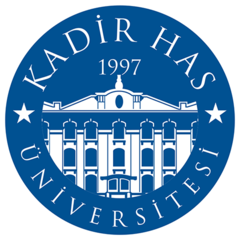

# Artificial Intelligence I: Introduction to Data Science and Machine Learning

### This repository contains codes and documents for the course *Artificial Intelligence I: Introduction to Data Science and Machine Learning* course taught in Kadir Has University. This course was carried out in cooperation with the Lifelong Education Center (Yaşamboyu Eğitim Merkezi) at Kadir Has University.

### Original Course Link (In Turkish)
[Artificial Intelligence I: Introduction to Data Science and Machine Learning Certificate Program](https://ybea.khas.edu.tr/programs/yapay-zeka-i-veri-bilimi-ve-makine-ogrenmesine-giris-sertifika-programi-313)

**NOTE:** This course contains both Turkish and English materials. The files ending with **_TR** are in Turkish.

## Instructors
[H. Fuat Alsan (PhD Candidate in Computer Science)](https://github.com/fualsan/)

[Sena Kılınç (PhD Candidate in Computer Science)](https://github.com/Sena-Kilinc)

[Assoc. Prof Dr. Taner Arsan](https://www.khas.edu.tr/en/academic-staff/119)

## Topics

### Week 1: Introduction to Python
* General introduction
* Introduction to Python programming language

### Week 2: Introduction to Data Science
* NumPy
* Pandas
* Matplotlib
* Exploratory data analysis (EDA)

### Week 3: Introduction to Machine Learning
* Gradient descent with basic linear models
* Regression, classification and clustering
* Sklearn
* (Extra EDA examples)

### Week 4: Model Selection
* Advanced models
* Ensemble models
* Grid Search CV
* Classification metrics
* Class imbalance

### Week 5: Time Series & Anomaly Detection
* Time series analysis
    * Stationary, non-stationary
    * Autocorrelation (ACF), Partial autocorrelation (PACF)
    * Seasonality
    * Seasonal decomposition
* Threshold anomaly detection
* Interquantile Range (IQR) anomaly detection
* Seasonal decomposition anomaly detection
* ARIMA, Auto ARIMA
* (Extra machine learning examples)

### Week 6: MLOps
* Web service basics
* REST APIs
* Microservies architecture
* Docker 
* MLFlow
* Overall software architecture

## License

The code is licensed under the 

[MIT License](https://github.com/fualsan/AI_1_DataScience_MachineLearning/blob/main/LICENSE)